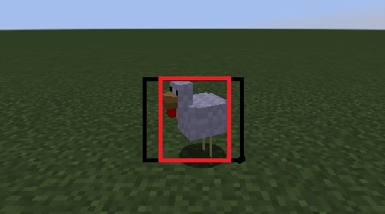
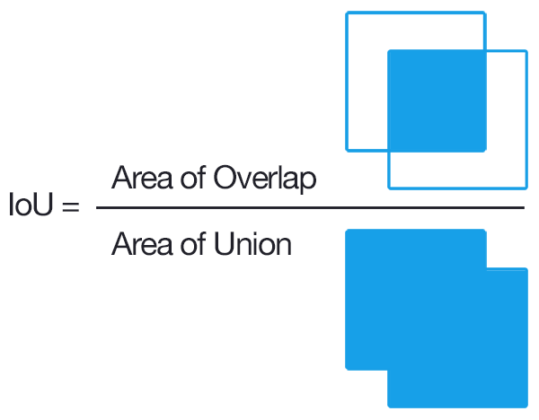

<!-- <iframe width="1061" height="597" src="#"
frameborder="0" allow="accelerometer; autoplay; clipboard-write;
encrypted-media; gyroscope; picture-in-picture" allowfullscreen></iframe> -->

## Project Summary

---

Our mission is to process JPG images taken from the agents’ perspective and identify specific Minecraft mobs within the image. We not only want to identify what type of mobs there are (classic image prediction problem) but also where the mob is within an image, drawing a bounding box around it (object detection problem). We want our agent to be able to identify different mob species (pigs, cows, chicken, etc) and distinguish between multiple “instances” of the same mobs (e.g. 2 chickens in a single image).

For the longest time, we’ve always wanted machines to be able to see the world as we do. But also for that longest time there wasn’t any good way to generalize “seeing things”. The best procedural method up to that point was using a contrast-based system that could segment the video by a certain contrast threshold. However, even that paradigm has it’s flaws, such as: when contrasts aren’t the main determiner of object boundaries,  the lack of extensibillity of the model object detection on other objects. However with the advent of AI and Machine Learning, we can now create a generic, scalable model that can classify and detect objects effectively and easily. By leveraging the use of cutting edge developments in image processing, we hope to create a model in Minecraft that will truly tsee the game as we do.

* [Link to our source code](https://github.com/KimJee/Mobbox)

## Approach

---

We wanted to use state-of-the-art technologies to try to make the best model for the data we can generate. Luckily, there are many computer vision libraries, frameworks, and online tutorials to support our process. While searching for object detection models, we came across this article: [Link](https://stackabuse.com/object-detection-with-imageai-in-python/) that discusses different types of techniques to recognize and filter an image. Eventually, we came across these models: [YOLOv3](https://github.com/eriklindernoren/PyTorch-YOLOv3) [ImageAi](https://github.com/OlafenwaMoses/ImageAI)

Or simply put, we use a two-pronged approach to create the best model. From one perspective we use the first library with the same default base-model used in the status report, and from the second perspective we use the ImageAI model with it’s differing base-model and independently trained these two models using their respective libraries, with the same training data to see differences in the result.

We utilized this [YOLO](https://github.com/ultralytics/yolov3) library. YOLO stands for “You Only Look Once” which is a computer vision paradigm for a one-scan, super fast library that trades accuracy for speed. The original link comes from the University of Washington by Joseph Redmon and Ali Farhadi. To summarize their paper, YOLOv3 is a system of convolutional neural networks that has 3 main layers. Each one extracts features at their resolution and tries to predict it given the information passed through the previous layers. After passing through all layers, it tries to use that information to classify the object in the picture and determine its location in a bounding box.

The idea of “convolution” is to ‘filter’ over an image to create a feature map that summarizes the detected features in the input. Think of each image as a stage and each “convolution” is a spotlight that tries to pick up different details of the stage. For example, one layer could see the actors, another could see the backdrop, and by piecing together these “features,” it blends these ideas to understand what is happening. The authors also upsample feature-rich portions of the image which allows for more information per pixel. In the last leg of prediction, they use k-means clustering to determine the bounding box.

We used the provided YOLOv3 model with transfer learning. YOLOv3 comes with its own weights that define their pretrained model; with transfer learning, we customize their weights by training it further to complete our specific object detection task. In order to customize the model to detect mobs on Minecraft, we first generated a dataset of training and validation images and the images’ corresponding ground truth bounding boxes. These images were created by parsing a video created by the Malmo video producer. Two versions of the video were produced: a normal video of what is seen on Minecraft and a colormap video that blocks each entity/block into different solid colors. The colormap is used to create the ground truth bounding boxes. Using the YOLOv3 weights as a starting point, we then trained our model, modifying their weights to fit our data. Our current model has run a total of 20 epochs on about 300 training images.

## Evaluation

---

We have two quantitative metrics to measure the success of our model:

### Intersection over Union (IoU)

IoU measures the similarity between the predicted bounding box and the ground truth bounding box. It finds the ratio between the intersection between the bounding boxes, or the area of pixels that are in both boxes, and the union of the bounding boxes, or the complete area of pixels covered by both boxes together. To compare two different models (e.g. a model we’ve just trained compared to the baseline or previous model), we run the same test images through each model, generating a text file of the predicted bounding boxes for each image. Using the ground truth and predicted bounding boxes, we calculate the IoU for each image and can compare the values generated by each model.

Example from current model: IoU = 0.8826917247650803
Red box = ground truth, green box = prediction

### Mean Average Precision (mAP)

The mAP is a metric for the accuracy of an object detection model. It is represented by the area under the curve when plotting the model’s precision against its recall. A correct prediction occurs if the IoU is greater than a specified threshold (YOLOv3 uses IoU > 0.6). The model’s precision is its proportion of true positives out of all of the images and its recall is the proportion of true positives out of the possible positives.

Below are values received from the ImageAI model after 10 epochs.

[{'model_file': 'ImageAI_rsc/models/final-model-malmo/detection_model-ex-011--loss-0004.496.h5',
'using_iou': 0.5,
'using_object_threshold': 0.3,
'using_non_maximum_suppression': 0.5,
'average_precision': {'chicken': 0.8836422909545835, 'cow': 0.6636756691843161, 'pig': 0.6809333179065912, 'villager': 0.5585584963470884},
 'evaluation_samples': 245, 'map': 0.6967024435981448}]

To **qualitatively** assess our model, we are able to use OpenCV to draw our bounding boxes on top of the images. We can look at the visual accuracy of the bounding boxes as well as the consistency across many frames of a video (see our video summary).

### New Updates

### Challenges

We have now tried to extend our model to different mobs, and with that came it’s own challenges. Our model can now detect 4 different types of mobs. These four minecraft mobs include, chickens , villagers, cows, and pigs. We choose these four mobs because of the variation in size, shape, and color from the background.

Some of the challenges we faced while extending our model was that out confidence levels had dropped exponentially. In the previous model we had pretty high confidence because our chicken was a solitary, and was easy to look for with high contrast.

### Biome Distractors

Also because of the differences in the biomes, there was much more distractors from the mobs themselves. For instance, in the picture on the bottom left, we see that the environment is filled with trees, with “wood” in a reddish-purple, “leaf-block” the neon-green, and “vine-block” the darker-green. All of these distractors add complexity to our model, which then reduces our confidence in any given image.

### Testing Our Model with Unseen Data

So in our final model we had trained our model on these different categories of training data.

Biomes {Plains, None, Swamp, Desert, Forest}
And these combinations… {Cow, Cow-Duplicates, Villagers, Villager-Duplicates, Cow+Villager, Chicken, Pig}

In comparison, out testing set included...

Biomes {Ice Plains, Birch Forest}
And these combinations… {Chicken,chicken+cow+pig, chicken+cow+villager, chicken+pig, cow, cow+pig, pig, pig+pig}

### Color Fixing

We also had some troubles with some of the differences in colors. By using Malmo’s color mapping, there are similar blocks/mob colors that are of a really same color. Thus, we had to use an n-color filter to threshold color values to minimize the error in our ground-truth labeling.

Additionally, in some of our images you’ll see a “sheep” mob that is not detected by our algorithm. And the reason why that is, is because of the Malmo’s color-map utility will produce a bad color-mapping without a reference mob to take the “ground and shadows” color.

### Other Problems

A common problem with our detection algorithm was that it draws multiple bounding boxes on one instance of a mob. But this is probably due to the automated-color-mapping pipeline we have in order to generate the ground truth without the painstaking label to hand-label a couple thousand of images.

## Resources Used

### AI/ML Libraries & Models & Code

* [Link to main YOLOv3 algorithm](https://github.com/ultralytics/yolov3)
* [Link to another object detection library](https://github.com/OlafenwaMoses/ImageAI)
* [Link to PyTorch Implementation](https://github.com/eriklindernoren/PyTorch-YOLOv3)

### DevTools

* [Weights & Biases](https://wandb.ai/)
* [Image Extraction with OpenCV](https://theailearner.com/2018/10/15/creating-video-from-images-using-opencv-python/)
* [Merging .JPG into .MP4](https://theailearner.com/2018/10/15/creating-video-from-images-using-opencv-python/)

### Research papers & Concept Overviews

* [How to implement your own custom model](https://imageai.readthedocs.io/en/latest/customdetection/)
* [What is transfer learning?](https://appsilon.com/transfer-learning-introduction/)
* [Overview of CNNs](https://towardsdatascience.com/a-comprehensive-guide-to-convolutional-neural-networks-the-eli5-way-3bd2b1164a53?gi=2a61e97f5a9d) 
* [Intro to object detection](https://stackabuse.com/object-detection-with-imageai-in-python/)
* [A research paper about  how YOLOv3 works](https://pjreddie.com/media/files/papers/YOLOv3.pdf) 

### StackOverflow & Tutorials

* [ImageAI Object Detection](https://stackabuse.com/object-detection-with-imageai-in-python/)
* [Evaluating Object Detection Models](https://manalelaidouni.github.io/manalelaidouni.github.io/Evaluating-Object-Detection-Models-Guide-to-Performance-Metrics.html#precision---recall-and-the-confidence-threshold)
* [Another tutorial about object detection models](https://towardsdatascience.com/chess-rolls-or-basketball-lets-create-a-custom-object-detection-model-ef53028eac7d)
* [Jonathan Hui's blog](https://jonathan-hui.medium.com/)

