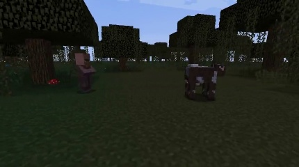
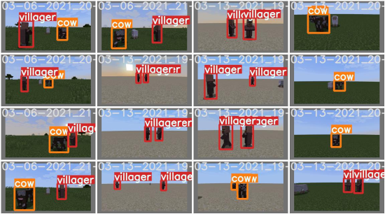
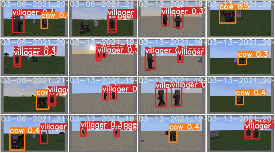

<!-- <iframe width="1061" height="597" src="https://youtu.be/embed/jo9RK8UAzMQ"
frameborder="0" allow="accelerometer; autoplay; clipboard-write;
encrypted-media; gyroscope; picture-in-picture" allowfullscreen></iframe> -->
<iframe width="1061" height="597" src="https://www.youtube.com/embed/jo9RK8UAzMQ" frameborder="0" allow="accelerometer; autoplay; clipboard-write; encrypted-media; gyroscope; picture-in-picture" allowfullscreen></iframe>

## Project Summary

---

Our mission is to process JPG images taken from the agents’ perspective and identify specific Minecraft mobs within the image. We not only want to identify what type of mobs there are (classic image prediction problem) but also where the mob is within an image, drawing a bounding box around it (object detection problem). We want our agent to be able to identify different mob species (pigs, cows, chicken, and villager) and distinguish between multiple “instances” of the same mobs (e.g. 2 chickens in a single image), and work in varied biomes native to Minecraft (plains, forests, desert, swamplands and more). 

For the longest time, we’ve always wanted machines to be able to see the world as we do. But also for that longest time there wasn’t any good way to generalize “seeing things”. The best procedural method up to that point was using a contrast-based system that could segment the video by a certain contrast threshold. However, even that paradigm has its flaws, such as when contrasts aren’t the main determiner of object boundaries or the lack of extensibility of the model object detection on other objects. However, with the advent of AI and Machine Learning, we can now create a generic, scalable model that can classify and detect objects effectively and easily. By leveraging the use of cutting edge developments in image processing, we hope to create a model in Minecraft that will truly see the game as we do.

* [Link to our source code](https://github.com/KimJee/Mobbox)

## Approach

---

We wanted to use state-of-the-art technologies to try to make the best model for the data we can generate. Luckily, there are many computer vision libraries, frameworks, and online tutorials to support our process. While searching for object detection models, we came across this article: (Link)[https://stackabuse.com/object-detection-with-imageai-in-python/] that discusses different types of techniques to recognize and filter an image. Eventually, we came across these models: (1) [https://github.com/ultralytics/yolov3] (2) [https://github.com/OlafenwaMoses/ImageAI] 

Simply put, we use a two-pronged approach to create the best model. From one perspective we use the first library with the same default base-model used in the status report, and from the second perspective we use the ImageAI model with its differing base-model and independently trained these two models using their respective libraries, with the same training data to see differences in the result. 

Both models used the YOLO algorithm. YOLO stands for “You Only Look Once” which is a computer vision paradigm for a one-scan, super fast library that trades accuracy for speed. The original link comes from the University of Washington by Joseph Redmon and Ali Farhadi. To summarize their paper, YOLOv3 is a system of convolutional neural networks that has 3 main layers. Each one extracts features at their resolution and tries to group similar primitive features given the information passed through the previous layers. After passing through all layers, it tries to use that information to classify the object in the picture and determine its location in a bounding box.

We used the provided YOLOv3 model with transfer learning. YOLOv3 comes with its own weights that define their pretrained model; with transfer learning, we customize their weights by training it further to complete our specific object detection task. In order to customize the model to detect mobs on Minecraft, we first generated a dataset of training and validation images and the images’ corresponding ground truth bounding boxes. These images were created by parsing a video created by the Malmo video producer. Two versions of the video were produced: a normal video of what is seen on Minecraft and a colormap video that blocks each entity/block into different solid colors. The colormap is used to create the ground truth bounding boxes. Using the YOLOv3 weights as a starting point, we then trained our model, modifying their weights to fit our data. Our current model has run a total of 20 epochs on about 300 training images.

### New Features and Training

From where we left off in the status report, our model can now detect 4 different types of mobs: chickens, villagers, cows, and pigs. We choose these four mobs because of the variation in size, shape, and color from the background. We also produced training data in 5 different biomes: none (empty flatworld), plains, forest, swamplands, and desert. 

We generated data in different categories. For each of the 5 biomes, we created 50-70 images for each of these different combinations of mobs: 1 cow, 1 chicken, 1 pig, 1 villager, 1 cow and 1 villager, 2 cows, and 2 villagers. Thus, it resulted in a training dataset of over 1700 training images and over 400 validation images.

Using the default weights as a starting point, we then trained our model, modifying their weights to fit our data. Both models, ImageAI and YOLOv3, trained for 15 epochs. We will discuss the results in the Evaluation section.

However, in extending the model to include these mobs and biomes, we came across some new challenges.

### Color Fixing

We first had some trouble with colors. By using Malmo’s color mapping utility -- a utility that transforms the minecraft video image, into a uniquely colored world that identifies each entity-- we have been able to generate a necessary, semi-automated system of labeling ground truth. However, the compression and image quality created from the colormap image files created noisy contours in OpenCV that caused problems for our automated-color-map-labeler. Thus, we had to use color value threshold to create smoother contours around each mob and minimize the error in our ground-truth labeling. This also helped in being able to detect multiple mobs within the same image.

## Evaluation
---

### Testing Our Model with Unseen Data

In our final model we had trained our model on these different categories of training data:
Biomes: None, Plains, Swamplands, Desert, Forest
In combination with these mobs: 1 Cow, 1 Pig, 1 Chicken, 1 Villager, 1 Villager and 1 Cow, 2 Cows, and 2 Villagers

In comparison, our testing set consists of...

Biomes: Ice Plains, Birch Forest
With these mob combinations: 1 Cow, 1 Pig, 1 Chicken, 1 Villager, 2 Pigs, 1 Pig and 1 Chicken, 1 Cow and 1 Pig, 1 Cow and 1 Chicken and 1 Villager, 1 Cow and 1 Chicken and 1 Pig, all 4 mobs

### Why we chose the combinations 

In our training set, the model was tested on all combinations of cow-villager duplicates, but no combinations with chickens or pigs. We left out this information in the training set because we wanted to explore the ability of our model to generalize information. Could the model generalize seeing chickens and pigs not only as singletons, but as objects that could be bundled together with other mobs?

Another facet we wanted to explore was in terms of duplicate mobs. As seen above, we only trained on “singleton” pigs, yet we tested with “clones” of pigs. This would help us understand if our model could understand the duplicity of any given mob. 

[Left: *A cow and a pig in the Ice Plains Biome*] [Right: *Chicken in the Birch Forest* ]

### Why we chose the biomes 

Our training biomes consisted of biomes with little distractions (Plains, None), biomes with trees (Swamplands, Forest), or the Desert. In order to see if our model could achieve similar results with our testing data, the first biome we experimented with was the Birch Forest. This biome was similar enough to the tree-based biomes in the testing data, but still new enough, due to the new kinds of trees introduced, to be tested upon. This acted as our transitional biome to see if our model had met some of the closer goals.

The next biome we used in testing was the Ice Plains biome. This biome consists mostly of snow, and while it is similar to the plain biomes above, it was still different enough due to the stark contrast of the main biome color, white. This would provide some difficulties for the model, especially for certain types of mobs. The chicken, for example, is mostly a white mob, which would be difficult to contrast against the white-textured snow. This would be a good test to see if our model can differentiate between the subject-- the chicken-- and the background--- the icy plains.

### Metrics

We have two quantitative metrics to measure the success of our model:

[Red Box = Ground Truth, Black Box = Prediction]

### Intersection over Union (IoU)

IoU measures the similarity between the predicted bounding box and the ground truth bounding box. It finds the ratio between the intersection between the bounding boxes, or the area of pixels that are in both boxes, and the union of the bounding boxes, or the complete area of pixels covered by both boxes together. To compare two different models (e.g. a model we’ve just trained compared to the baseline or previous model), we run the same test images through each model, generating a text file of the predicted bounding boxes for each image. Using the ground truth and predicted bounding boxes, we calculate the IoU for each image and can compare the values generated by each model.

### Mean Average Precision (mAP)

The mAP is a metric for the accuracy of an object detection model. It is represented by the area under the curve when plotting the model’s precision against its recall. A correct prediction occurs if the IoU is greater than a specified threshold (we used IoU > 0.5). The model’s precision is its proportion of true positives out of all of the images and its recall is the proportion of true positives out of the possible positives.

The ImageAI model had a final mAP score of 0.6967.
The YOLOv3 model had a final mAP score of 0.9927.

As we can see, the YOLOv3 model had an overall better quantitative result than the ImageAI model.

### Other Observations and Conclusions

[Left: *A color-map view of the jungle biome*] [Right: *Picture of the jungle biome* ]

### Challenges & Features

One of the next steps in building our model was providing the ability to extend it to different mobs. Our model can now detect 4 different types of mobs. These four minecraft mobs include, chickens, villagers, cows, and pigs. We choose these four mobs because of the variation in size, shape, and color from the background. However, in extending the model to include these mobs, we came across some new challenges.

[Left: *A rose by any other name is just as sweet?*] 

### Biome Distractors

The various biomes resulted in many more distractors from the mobs themselves. For instance, in the picture on the left, we see that the environment is filled with trees, with “wood” in a reddish-purple, “leaf-block” the neon-green, and “vine-block” the darker-green. All of these distractors add complexity to our model, which then reduces our confidence in any given image.

This is well shown in the bottom left image, the ImageAI model has a 98.234% confidence that the actual red rose is a pig, instead of detecting the actual pig next to the grass. Both the ImageAI and YOLOv3 models ran into this issue.

[Left: *The model thinks that the chicken is a villager*] [Right: *The double labelling of the pig-villager*]

### Other Problems

A common problem with the ImageAI model was that it draws multiple overlapping bounding boxes on one instance of a mob. But this is probably due to the automated-color-mapping pipeline we have created to generate the ground truth labels, and the lack of training required by a detector this large.

Both models also had trouble detecting mobs when they were too close to the agent (and really big in the image) or too far from the agent (and really small in the image). This would require a more extensive dataset to cover these cases in order to improve the accuracy of the models.

### Results [Jee’s Model]

Below are values received from the ImageAI model after roughly 10 epochs.

Here is some sample data of the ImageAI model working on multiple mobs in the image.

[Image of new photo catching multiple mobs]
[Create a gif of the model working on all of the images on the gif]

[{'model_file': 'ImageAI_rsc/models/final-model-malmo/detection_model-ex-011--loss-0004.496.h5', 
'using_iou': 0.5, 
'using_object_threshold': 0.3, 
'using_non_maximum_suppression': 0.5, 
'average_precision': {'chicken': 0.8836422909545835, 'cow': 0.6636756691843161, 'pig': 0.6809333179065912, 'villager': 0.5585584963470884},
 'evaluation_samples': 245, 'map': 0.6967024435981448}]

From this we can see that the easiest to detect in order was, chickens, cows, pigs, then villagers. I have reason to believe it’s because of the broad contrast in color of the chicken which makes it easier to detect in comparison to the others. But it seems like a villager is either hit or miss. Qualitatively speaking, my model was bad. Out of all of 110 images selected as a testing set, only about 30 of them had labels. And from the 30 that had labels, many were misclassified, double classified, or had the plethora of problems mentioned above.

### Results [Natalia’s Model]

Below is a subset of the validation data the YOLOv3 model trained with. The model is highly accurate, but especially for mobs that are at a middle distance away from the agent and are not directly next to any other mobs in the frame. 

The most significant pitfall of my model is in detecting mobs that are slightly overlapping in the frame; for instance, if a chicken is standing in front of a cow and covering part of its legs, the model will not detect the cow. In addition, the model does not do well with scaled versions of the mobs. For example, if a cow is very close to the agent, it will appear very large in the frame. The model is not able to detect that it is a cow even though it is clearly visible.

[Left-hand-side Ground Truth, Right-hand-side Natalia’s Model Predictions]

## Resources Used

### AI/ML Libraries & Models & Code

* [Link to main YOLOv3 algorithm](https://github.com/ultralytics/yolov3)
* [Link to another object detection library](https://github.com/OlafenwaMoses/ImageAI)
* [Link to PyTorch Implementation](https://github.com/eriklindernoren/PyTorch-YOLOv3)

### DevTools

* [Weights & Biases](https://wandb.ai/)
* [Image Extraction with OpenCV](https://theailearner.com/2018/10/15/creating-video-from-images-using-opencv-python/)
* [Merging .JPG into .MP4](https://theailearner.com/2018/10/15/creating-video-from-images-using-opencv-python/)

### Research papers & Concept Overviews

* [How to implement your own custom model](https://imageai.readthedocs.io/en/latest/customdetection/)
* [What is transfer learning?](https://appsilon.com/transfer-learning-introduction/)
* [Overview of CNNs](https://towardsdatascience.com/a-comprehensive-guide-to-convolutional-neural-networks-the-eli5-way-3bd2b1164a53?gi=2a61e97f5a9d) 
* [Intro to object detection](https://stackabuse.com/object-detection-with-imageai-in-python/)
* [A research paper about  how YOLOv3 works](https://pjreddie.com/media/files/papers/YOLOv3.pdf) 

### StackOverflow & Tutorials

* [ImageAI Object Detection](https://stackabuse.com/object-detection-with-imageai-in-python/)
* [Evaluating Object Detection Models](https://manalelaidouni.github.io/manalelaidouni.github.io/Evaluating-Object-Detection-Models-Guide-to-Performance-Metrics.html#precision---recall-and-the-confidence-threshold)
* [Another tutorial about object detection models](https://towardsdatascience.com/chess-rolls-or-basketball-lets-create-a-custom-object-detection-model-ef53028eac7d)
* [Jonathan Hui's blog](https://jonathan-hui.medium.com/)
