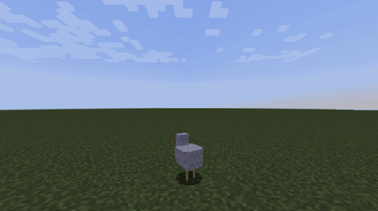
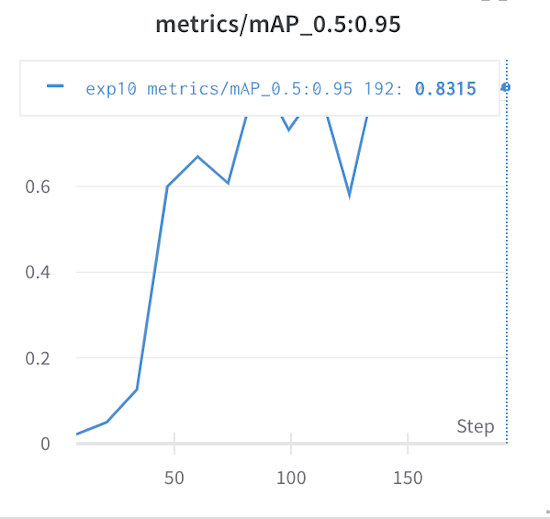
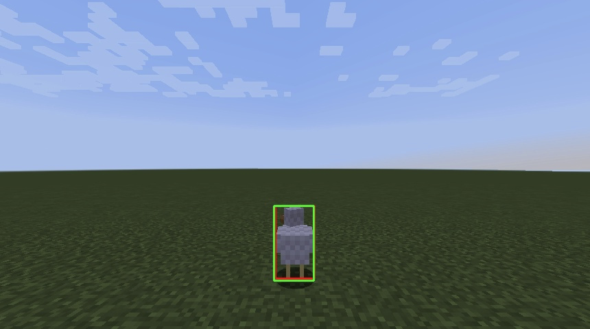

### Welcome to Natalia & Jee's Project for CS175
---

[//] 
[//] 
[//] 
[//] 
[//] 
[//] 
[//] 
[//] 
[//] 

### Resources
(Source code)[https://github.com/KimJee/Phoenix]

Reports:

- [Proposal](proposal.html)
- [Status](status.html)
- [Final](final.html)

