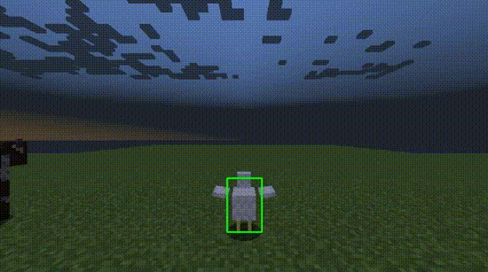

**A pre-trained convolutional neural networked designed to see mobs in Minecraft!**

## From this, to this!

We grab the two images.

We then train the model using the intersection-over-union metric.
Then after some training...

We create model that can detect where the mob is on the screen.

### Meeting Times

Group Meetings: Thursday at 6:30pm and Saturday at 6:30pm

### Resources

* [Source code](https://github.com/KimJee/Phoenix)

* [Link to our introductory link to object detection](https://stackabuse.com/object-detection-with-imageai-in-python/)

* [Link to PyTorch Implementation](https://github.com/eriklindernoren/PyTorch-YOLOv3)

* [Link to another object detection library](https://github.com/OlafenwaMoses/ImageAI)

* [Link to main YOLOv3 algorithm](https://github.com/ultralytics/yolov3)

* [A research paper about  how YOLOv3 works](https://pjreddie.com/media/files/papers/YOLOv3.pdf) 

* [How to implement your own custom model](https://imageai.readthedocs.io/en/latest/customdetection/)

* [What is transfer learning?](https://appsilon.com/transfer-learning-introduction/)

* [Overview of CNNs](https://towardsdatascience.com/a-comprehensive-guide-to-convolutional-neural-networks-the-eli5-way-3bd2b1164a53?gi=2a61e97f5a9d)

### Reports:

* [Proposal](proposal.html)
* [Status](status.html)
* [Final](final.html)
