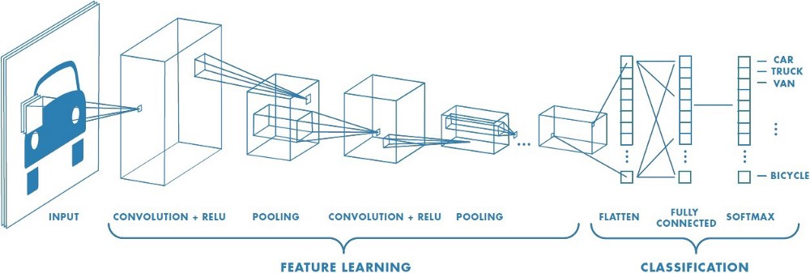
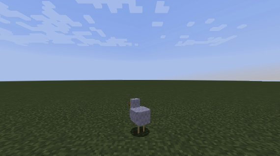
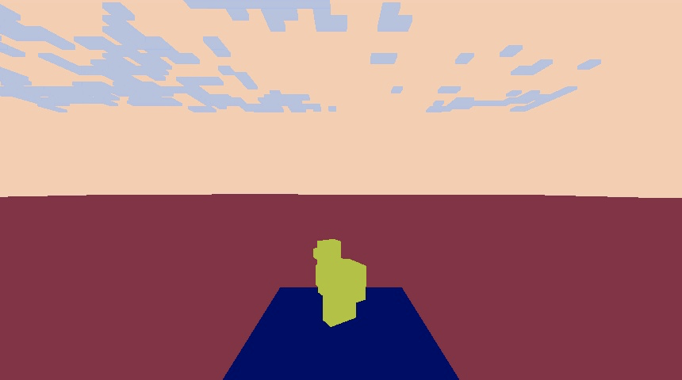
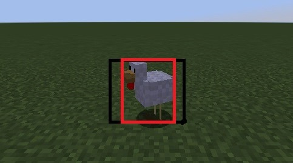
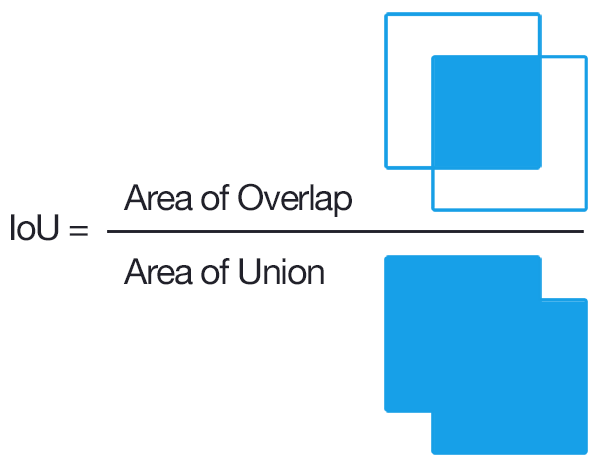
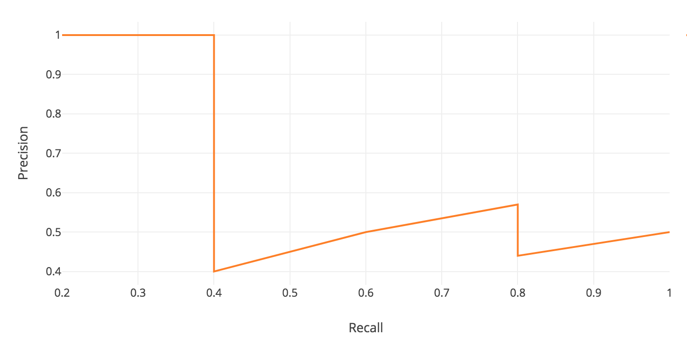
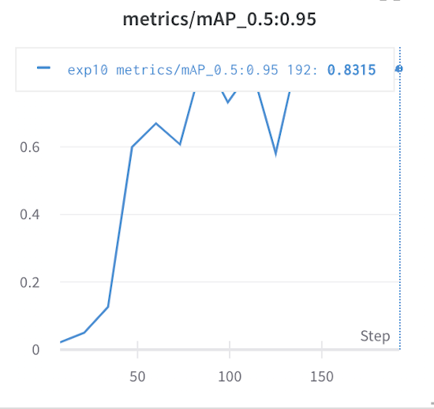
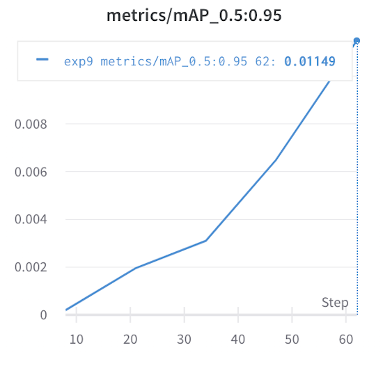

## Project Summary

---

Our mission is to process JPG images taken from the agents’ perspective and identify specific Minecraft mobs within the image. We not only want to identify what type of mobs there are (classic image prediction problem) but also where the mob is within an image, drawing a bounding box around it (object detection problem). We want our agent to be able to identify different mob species (pigs, cows, chicken, etc) and distinguish between multiple “instances” of the same mobs (e.g. 2 chickens in a single image).

A lot has changed from our proposal. With the professor’s permission we were allowed to pivot our project from a natural language processing project to a computer vision project.  

* [Link to our source code](https://github.com/KimJee/Mobbox)

## Approach

---

We wanted to use state-of-the-art technologies to try to make the best model for the data we can generate. Luckily, there are many computer vision libraries, frameworks, and online tutorials to support our process. While searching for object detection models, we came across this article: [Link](https://stackabuse.com/object-detection-with-imageai-in-python/) that discusses different types of techniques to recognize and filter an image. Eventually, we came across these models: [YOLOv3](https://github.com/eriklindernoren/PyTorch-YOLOv3) [ImageAi](https://github.com/OlafenwaMoses/ImageAI)

We utilized this [YOLO](https://github.com/ultralytics/yolov3) library. YOLO stands for “You Only Look Once” which is a computer vision paradigm for a one-scan, super fast library that trades accuracy for speed. The original link comes from the University of Washington by Joseph Redmon and Ali Farhadi. To summarize their paper, YOLOv3 is a system of convolutional neural networks that has 3 main layers. Each one extracts features at their resolution and tries to predict it given the information passed through the previous layers. After passing through all layers, it tries to use that information to classify the object in the picture and determine its location in a bounding box.

The idea of “convolution” is to ‘filter’ over an image to create a feature map that summarizes the detected features in the input. Think of each image as a stage and each “convolution” is a spotlight that tries to pick up different details of the stage. For example, one layer could see the actors, another could see the backdrop, and by piecing together these “features,” it blends these ideas to understand what is happening. The authors also upsample feature-rich portions of the image which allows for more information per pixel. In the last leg of prediction, they use k-means clustering to determine the bounding box.

We used the provided YOLOv3 model with transfer learning. YOLOv3 comes with its own weights that define their pretrained model; with transfer learning, we customize their weights by training it further to complete our specific object detection task. In order to customize the model to detect mobs on Minecraft, we first generated a dataset of training and validation images and the images’ corresponding ground truth bounding boxes. These images were created by parsing a video created by the Malmo video producer. Two versions of the video were produced: a normal video of what is seen on Minecraft and a colormap video that blocks each entity/block into different solid colors. The colormap is used to create the ground truth bounding boxes. Using the YOLOv3 weights as a starting point, we then trained our model, modifying their weights to fit our data. Our current model has run a total of 20 epochs on about 300 training images.

## Evaluation

---

We have two quantitative metrics to measure the success of our model:

### Intersection over Union (IoU)

IoU measures the similarity between the predicted bounding box and the ground truth bounding box. It finds the ratio between the intersection between the bounding boxes, or the area of pixels that are in both boxes, and the union of the bounding boxes, or the complete area of pixels covered by both boxes together. To compare two different models (e.g. a model we’ve just trained compared to the baseline or previous model), we run the same test images through each model, generating a text file of the predicted bounding boxes for each image. Using the ground truth and predicted bounding boxes, we calculate the IoU for each image and can compare the values generated by each model.

Example from current model: IoU = 0.8826917247650803
Red box = ground truth, green box = prediction

### Mean Average Precision (mAP)

The mAP is a metric for the accuracy of an object detection model. It is represented by the area under the curve when plotting the model’s precision against its recall. A correct prediction occurs if the IoU is greater than a specified threshold (YOLOv3 uses IoU > 0.6). The model’s precision is its proportion of true positives out of all of the images and its recall is the proportion of true positives out of the possible positives.

Below are graphs for our trained model after 5 epochs (mAP=0.01149) compared to after 20 epochs (mAP=0.8315).

To **qualitatively** assess our model, we are able to use OpenCV to draw our bounding boxes on top of the images. We can look at the visual accuracy of the bounding boxes as well as the consistency across many frames of a video (see our video summary).

## Remaining Goals & Challenges

Our main long term goal is for our model to identify different types of mobs. As of right now, the only object our model can detect is a chicken. We also could expand the model to identify different types of blocks as well (like finding trees). The other main goal is for our agent to detect multiple instances of the same mob in a single frame.

One challenge we have faced is overfitting our model. Right now, our dataset is composed of different images of a single chicken in an empty flatworld. The only variation is the angle and the position (slightly) of the chicken. In the next few weeks, we will generate more images with varying sceneries and the chicken (or whichever mob we want to detect) in different distances. We also would like to experiment with more object detection models aside from YOLOv3 and Resnet.

We’ve created a data pipeline so that we don’t have to hand label each individual image. However, the most significant challenge we have encountered is Malmo’s colormap recording. Malmo colormap does not produce the cleanest images for the ground truth because it has slight variations in the pixel colors that border two different entities. This causes inaccuracy in our ground truth bounding box data. We plan to create an algorithm that converts the Malmo colormap image into a version that only has k pixel colors (where k is the number of different entities/blocks in the image) to produce better ground truth labels.

The biggest struggle we anticipate is the duration of time taken to train our models. Currently with our limited dataset, it takes several hours for us to train a decent model with a low enough error rate. We also foresee a problem with the size of our image files. We have been using 860x480 images which is considered to be a large file size for machine learning applications and will increase the time spent training. To circumvent this, we can rescale our images before detecting the bounding boxes and passing it into the model to train.

## Resources Used

### Models

### DevTools

* [Link to our introductory link to object detection](https://stackabuse.com/object-detection-with-imageai-in-python/)

### Code docs

* [Link to PyTorch Implementation](https://github.com/eriklindernoren/PyTorch-YOLOv3)

### AI/ML Libraries

* [Link to another object detection library](https://github.com/OlafenwaMoses/ImageAI)

### Source Code

* [Link to main YOLOv3 algorithm](https://github.com/ultralytics/yolov3)

### StackOverflow & Others

* [A research paper about  how YOLOv3 works](https://pjreddie.com/media/files/papers/YOLOv3.pdf) 

* [How to implement your own custom model](https://imageai.readthedocs.io/en/latest/customdetection/)

* [What is transfer learning?](https://appsilon.com/transfer-learning-introduction/)

* [Overview of CNNs](https://towardsdatascience.com/a-comprehensive-guide-to-convolutional-neural-networks-the-eli5-way-3bd2b1164a53?gi=2a61e97f5a9d)
