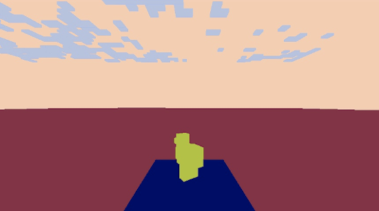

## Project Summary

Our mission is to process JPG images taken from the agents’ perspective and identify specific Minecraft mobs within the image. We not only want to identify what type of mobs there are (classic image prediction problem) but also where the mob is within an image, drawing a bounding box around it (object detection problem). We want our agent to be able to identify different mob species (pigs, cows, chicken, etc) and distinguish between multiple “instances” of the same mobs (e.g. 2 chickens in a single image).

A lot has changed from our proposal. With the professor’s permission we were allowed to pivot our project from a natural language processing project to a computer vision project.  

## Approach

We wanted to use state-of-the-art technologies to try to make the best model for the data we can generate. Luckily, there are many computer vision libraries, frameworks, and online tutorials to support our process. While searching for object detection models, we came across this article: [Link](https://stackabuse.com/object-detection-with-imageai-in-python/) that discusses different types of techniques to recognize and filter an image. Eventually, we came across these models: [YOLOv3](https://github.com/eriklindernoren/PyTorch-YOLOv3) [ImageAi](https://github.com/OlafenwaMoses/ImageAI)

We utilized this [YOLO](https://github.com/ultralytics/yolov3) library. YOLO stands for “You Only Look Once” which is a computer vision paradigm for a one-scan, super fast library that trades accuracy for speed. The original link comes from the University of Washington by Joseph Redmon and Ali Farhadi. To summarize their paper, YOLOv3 is a system of convolutional neural networks that has 3 main layers. Each one extracts features at their resolution and tries to predict it given the information passed through the previous layers. After passing through all layers, it tries to use that information to classify the object in the picture and determine its location in a bounding box.

The idea of “convolution” is to ‘filter’ over an image to create a feature map that summarizes the detected features in the input. Think of each image as a stage and each “convolution” is a spotlight that tries to pick up different details of the stage. For example, one layer could see the actors, another could see the backdrop, and by piecing together these “features,” it blends these ideas to understand what is happening. The authors also upsample feature-rich portions of the image which allows for more information per pixel. In the last leg of prediction, they use k-means clustering to determine the bounding box.

We used the provided YOLOv3 model with transfer learning. YOLOv3 comes with its own weights that define their pretrained model; with transfer learning, we customize their weights by training it further to complete our specific object detection task. In order to customize the model to detect mobs on Minecraft, we first generated a dataset of training and validation images and the images’ corresponding ground truth bounding boxes. These images were created by parsing a video created by the Malmo video producer. Two versions of the video were produced: a normal video of what is seen on Minecraft and a colormap video that blocks each entity/block into different solid colors. The colormap is used to create the ground truth bounding boxes. Using the YOLOv3 weights as a starting point, we then trained our model, modifying their weights to fit our data. Our current model has run a total of 20 epochs on about 300 training images.

## Evaluation

We have two quantitative metrics to measure the success of our model:

# List here

